#  Train App by Flutter

**Flutter**를 학습하기 위한 기차 예매 서비스앱입니다.

---

## 🚀 주요 기능
- **1. 출발역과 도착역을 선택**
- **2. 좌석을 선택후 예매**
- **3. 다크모드 지원**

## ⚙️ 추가 구현 사항
- **1. 출발역과 도착역이 같지 않게 예외처리**
- **2. 공통 버튼, 좌석박스를 컴포넌트화**
- **3. 예매 완료 후 토스트 메세지 출력**
- **4. 다국어 지원 구조를 사전 구현(현재는 한국어만 지원)**

## ⚙️ 실행 예시

  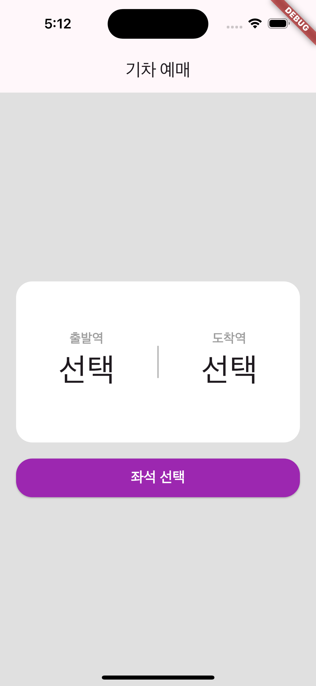
  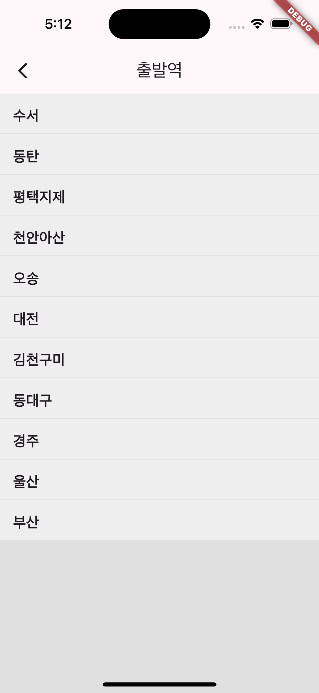
  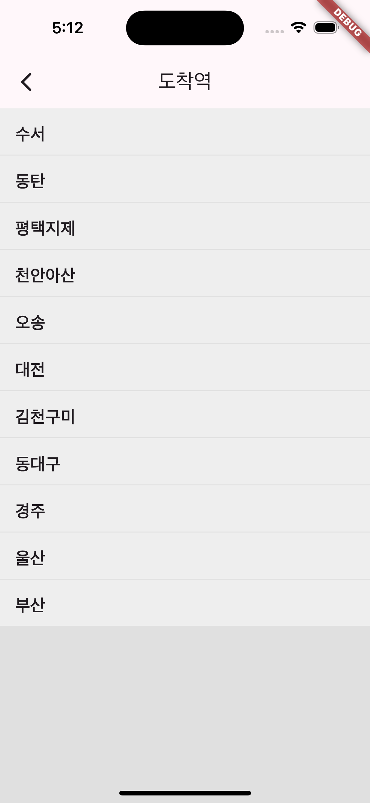
  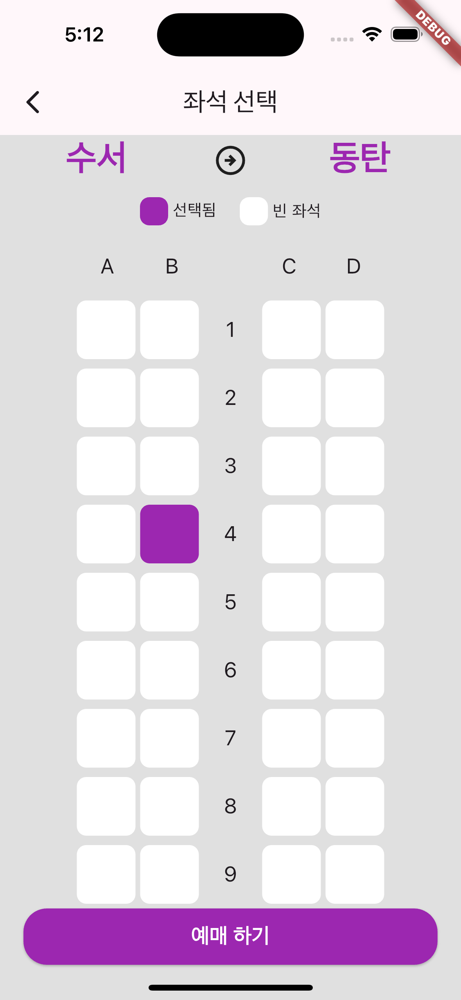
  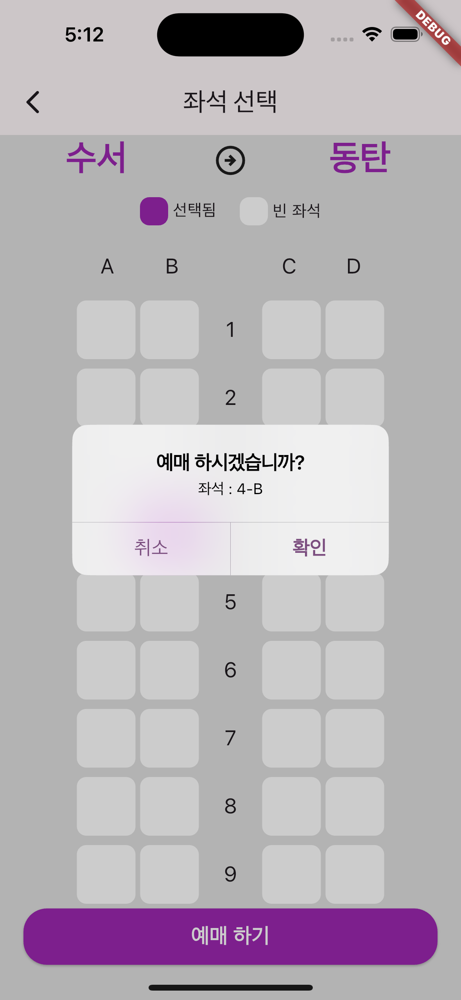
  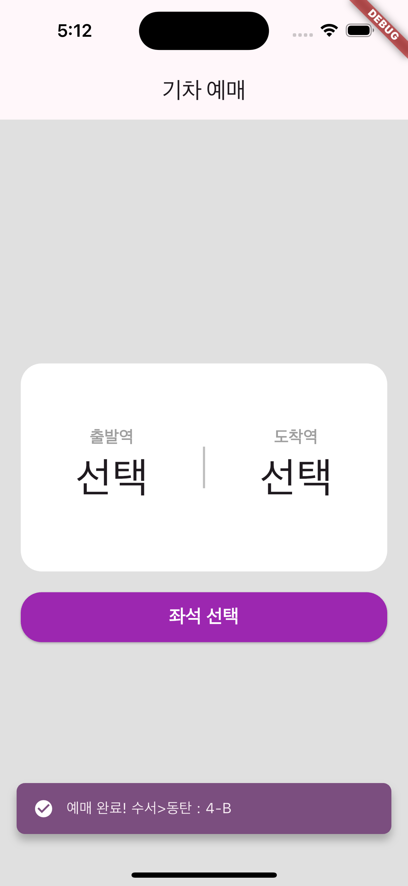

  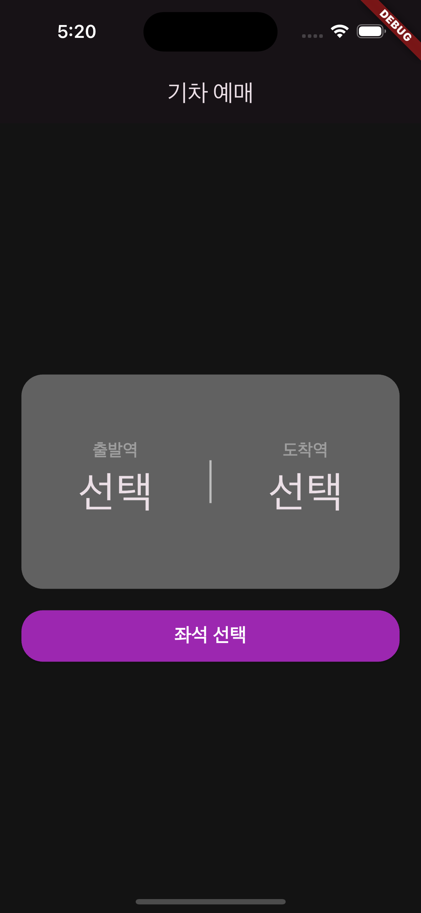
  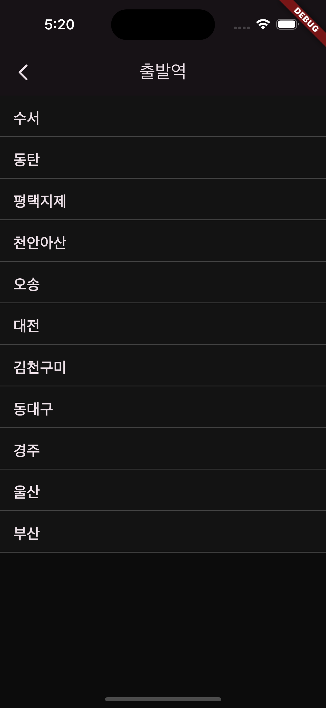
  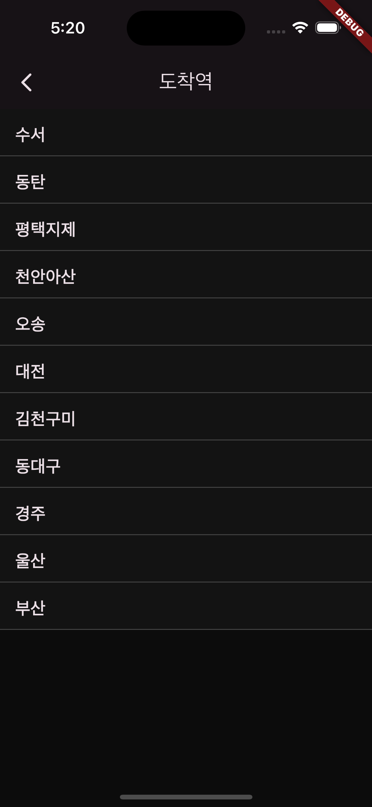
  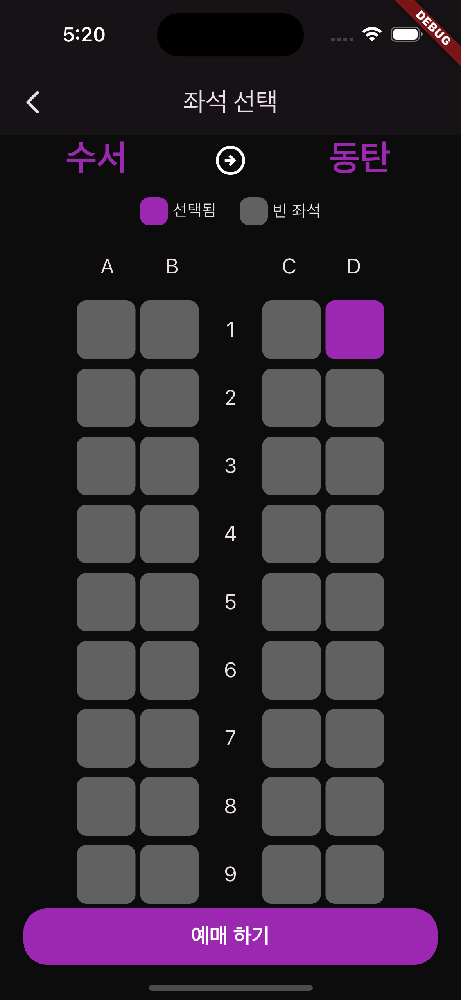
  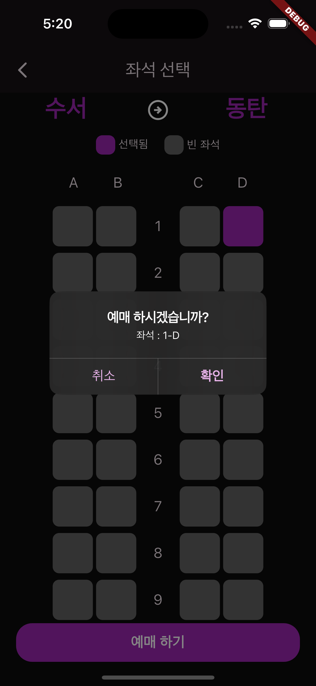
  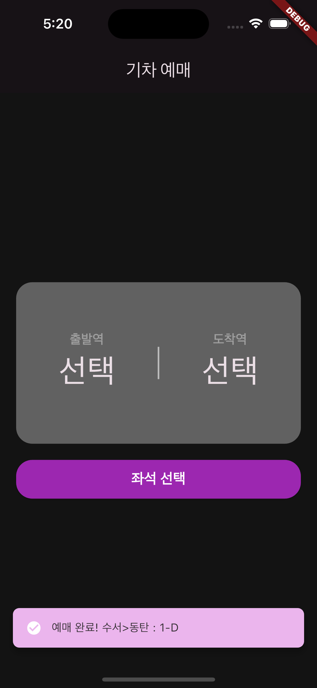

